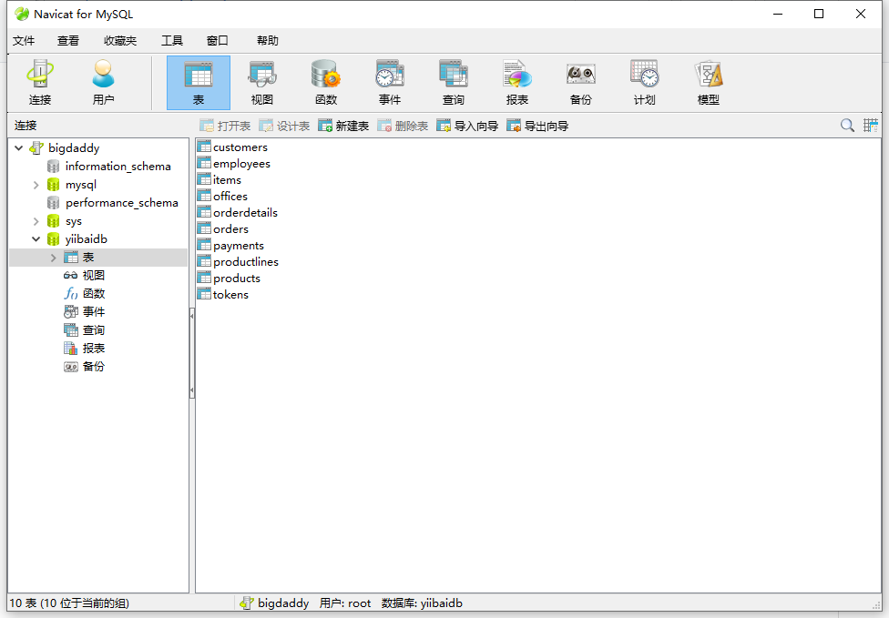
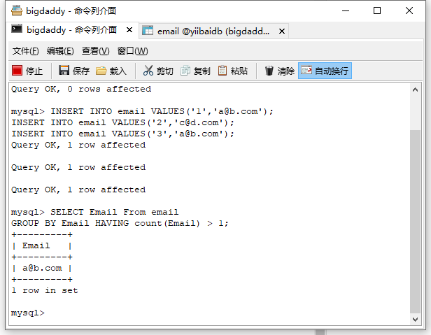
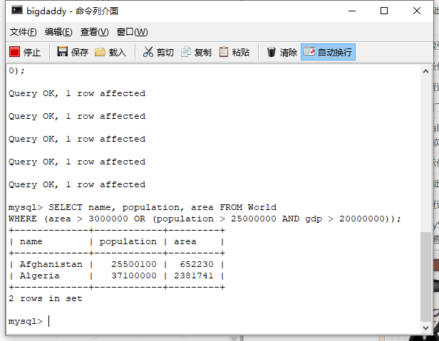

# MySQL 基础 （一）- 查询语句
## 学习内容
### 1.导入示例数据库
教程[MySQL导入示例数据库-MySQL教程™](https://www.yiibai.com/mysql/how-to-load-sample-database-into-mysql-database-server.html)
打开Navicat，按F6打开命令行界面，输入
`CREATE DATABASE IF NOT EXISTS yiibaidb DEFAULT CHARSET utf8 COLLATE utf8_general_ci;`

MySQL示例数据库模式由以下表组成：

- `customers`: 存储客户的数据。
- `products`: 存储汽车的数据。
- `productLines`: 存储产品类别数据。
- `orders`: 存储客户订购的销售订单。
- `orderDetails`: 存储每个销售订单的订单产品数据项。
- `payments`: 存储客户订单的付款数据信息。
- `employees`: 存储所有员工信息以及组织结构，例如，直接上级(谁向谁报告工作)。
- `offices`: 存储销售处数据，类似于各个分公司。

### 2.SQL是什么？MySQL是什么？
SQL是一种用于操作数据库的语言，MySQL是市场上第一个可用的开源数据库之一。
SQL用于访问，更新和操作数据库中的数据。MySQL是一种RDBMS，它允许保持数据库中存在的数据。
SQL是结构化查询语言。MySQL是一个使用MYSQL存储，检索，修改和管理数据库的RDBMS。
SQL是一种查询语言，而MYSQL是数据库软件。

### 3. 查询语句 SELECT FROM 
- 语句解释：SELECT语句用途是从一个或多个表中检索信息
- 去重语句：使用 DISTINCT关键字，顾名思义，它指示数据库只返回不同的值。
注意：不能部分使用 DISTINCT，DISTINCT关键字作用于所有的列，不仅仅是跟在其后的那一列。例如，你指定SELECT DISTINCT vend_id, prod_price，除非指定的两列完全相同，否则所有的行都会被检索出来。
- 前N个语句：使用LIMIT关键字来限制最多返回多少行，
`eg:SELECT prod_name FROM Products LIMIT 0 OFFSET N;`
指示 MySQL等 DBMS返回从第 1行起的 N行数据。第一个数字是指从哪儿开始，第二个数字是检索的行数。
注意：第 0 行:第一个被检索的行是第 0行，而不是第 1行。
因此，LIMIT 1 OFFSET 1会检索第 2行，而不是第 1行。
- CASE…END 判断语句

### 4. 筛选语句 WHERE
- 语句解释：数据库表一般包含大量的数据，很少需要检索表中的所有行。通常只会根据特定操作或报告的需要提取表数据的子集。只检索所需数据需要指定搜索条件（search criteria），搜索条件也称为过滤条件（filter condition）。在SELECT语句中，数据根据WHERE子句中指定的搜索条件进行过滤。

- 运算符/通配符/操作符

### 5. 分组语句 GROUP BY
- 聚集函数：用于分组的function,根据一个或多个列对结果集进行分组。
- WHERE子句：分组查询可以在形成组和计算列函数之前具有消除非限定行的标准where子句。必须在group by子句之前指定where子句。
- HAVING子句：**GROUP BY子句之后使用Having子句**
GROUP BY子句后面包含了一个HAVING子句。HAVING类似于WHERE（唯一的差别是WHERE过滤行，HAVING过滤组）AVING支持所有WHERE操作符。

### 6.排序语句 ORDER BY 
- 你可以使用任何字段来作为排序的条件，从而返回排序后的查询结果。
- 你可以设定多个字段来排序。
- 你可以使用 ASC 或 DESC 关键字来设置查询结果是按升序或降序排列。 默认情况下，它是按升序排列。
- 你可以添加 WHERE...LIKE 子句来设置条件。

### 7. 函数
时间函数：用于时间或者日期计算的函数

```
SELECT ADDDATE("2019-03-01",INTERVAL 10 DAY)
```

数值函数：绝对值，三角函数、等

```
SELECT ABS(-1)
```

字符串函数：大小写切换、ascci码转换

```
SELECT ASCII(city) FROM offices;
```
### 8. SQL注释

```mysql
SELECT ASCII(city) FROM offices; --单行注释
/*多行注释
测试1
测试2
*/
```


### 9. SQL代码规范

**命名的建议**

- 使用统一的、描述性强的字段命名规则
- 保证字段名是独一无二且不是保留字的，不要使用连续的下划线，不用下划线结尾
- 最好以字母开头

id 标识符——user_id 用户标识 item_id 商品标识
dt 表示某个事件发生的时间——ord_dt 订单时间 exam_dt 考试时间
num 表示某事相关的数字——sale_num 销量
name 用字母表示名称——stu_name 学生名 等

总结id标识、dt时间、num数量、name名称

**格式建议**

最好使用标准SQL函数而不是特定供应商Oracle、Mysql等的函数以提高可移植性

大小写的运用，系统关键字大写，字段表名小写

灵活使用空格和缩进来增强可读性——两大法宝空白隔道与垂直间距

```mysql
select name,id,sex
from (select *
from school_score
where class_cd=110)
where sex = 'man'
and exam_dt = '2016-06-01';

--空白隔道+垂直间距+大小写+缩进
SELECT name, id, sex
 FROM (SELECT *
          FROM school_score
         WHERE class_cd = 110)
 WHERE sex = 'man'
   AND exam_dt = '2016-06-01';
```

1. 利用空格保持关键字对齐
2. 在等号前后（=）在逗号后（,）单引号前后（'）加上空格
3. 子查询缩进并对齐

**语法建议**

- 尽量使用BETWEEN而不是多个AND
- 同样，使用 IN 而不是多个OR
- 利用CASE语句嵌套处理更复杂的逻辑结构
- 避免UNION语句与临时表

```mysql
SELECT CASE postcode
       WHEN 'BN1' THEN 'Brighton'
       WHEN 'EH1' THEN 'Edinburgh'
       END AS city
  FROM office_locations
 WHERE country = 'United Kingdom'
   AND opening_time BETWEEN 8 AND 9
   AND postcode IN ('EH1', 'BN1', 'NN1', 'KW1');
```

### sql格式优化工具

**SQLinForm（SQL Formatter for Professionals - Also Free Online SQL Beautifiers & Plugins available）**http://www.sqlinform.com/

## 作业

### 项目一：查找重复的电子邮箱（难度：简单）
创建 email表，并插入如下三行数据
+----+---------+
| Id | Email   |
+----+---------+
| 1  | a@b.com |
| 2  | c@d.com |
| 3  | a@b.com |
+----+---------+

编写一个 SQL 查询，查找 email 表中所有重复的电子邮箱。
根据以上输入，你的查询应返回以下结果：
+---------+
| Email   |
+---------+
| a@b.com |
+---------+
说明：所有电子邮箱都是小写字母。

代码：
```
CREATE TABLE email (
ID INT NOT NULL PRIMARY KEY,
Email VARCHAR(255)
);

INSERT INTO email VALUES('1','a@b.com');
INSERT INTO email VALUES('2','c@d.com');
INSERT INTO email VALUES('3','a@b.com');

SELECT Email From email
GROUP BY Email HAVING count(Email) > 1;
```
运行结果：


### 项目二：查找大国（难度：简单）
创建如下 World 表
+-----------------+------------+------------+--------------+---------------+
| name            | continent  | area       | population   | gdp           |
+-----------------+------------+------------+--------------+---------------+
| Afghanistan     | Asia       | 652230     | 25500100     | 20343000      |
| Albania         | Europe     | 28748      | 2831741      | 12960000      |
| Algeria         | Africa     | 2381741    | 37100000     | 188681000     |
| Andorra         | Europe     | 468        | 78115        | 3712000       |
| Angola          | Africa     | 1246700    | 20609294     | 100990000     |
+-----------------+------------+------------+--------------+---------------+
如果一个国家的面积超过300万平方公里，或者(人口超过2500万并且gdp超过2000万)，那么这个国家就是大国家。
编写一个SQL查询，输出表中所有大国家的名称、人口和面积。
例如，根据上表，我们应该输出:
+--------------+-------------+--------------+
| name         | population  | area         |
+--------------+-------------+--------------+
| Afghanistan  | 25500100    | 652230       |
| Algeria      | 37100000    | 2381741      |
+--------------+-------------+--------------+

代码:
```
-- 创建表
CREATE TABLE World (
name VARCHAR(50) NOT NULL,
continent VARCHAR(50) NOT NULL,
area INT NOT NULL,
population INT NOT NULL,
gdp INT NOT NULL
);

-- 插入数据
INSERT INTO World VALUES( 'Afghanistan', 'Asia',652230,25500100,20343000);
INSERT INTO World VALUES( 'Albania', 'Europe' ,28748,2831741,12960000);
INSERT INTO World VALUES( 'Algeria', 'Africa' ,2381741,37100000,188681000);
INSERT INTO World VALUES( 'Andorra' , 'Europe' ,468,78115,3712000);
INSERT INTO World VALUES( 'Angola' , 'Africa' ,1246700,20609294,100990000);

SELECT name, population, area FROM World
WHERE (area > 3000000 OR (population > 25000000 AND gdp > 20000000));
```
运行结果：


**注：一些顺序问题：SELECT / FROM /WHERE (LIMIT /OFFSET)/GROUP BY/ HAVING **
